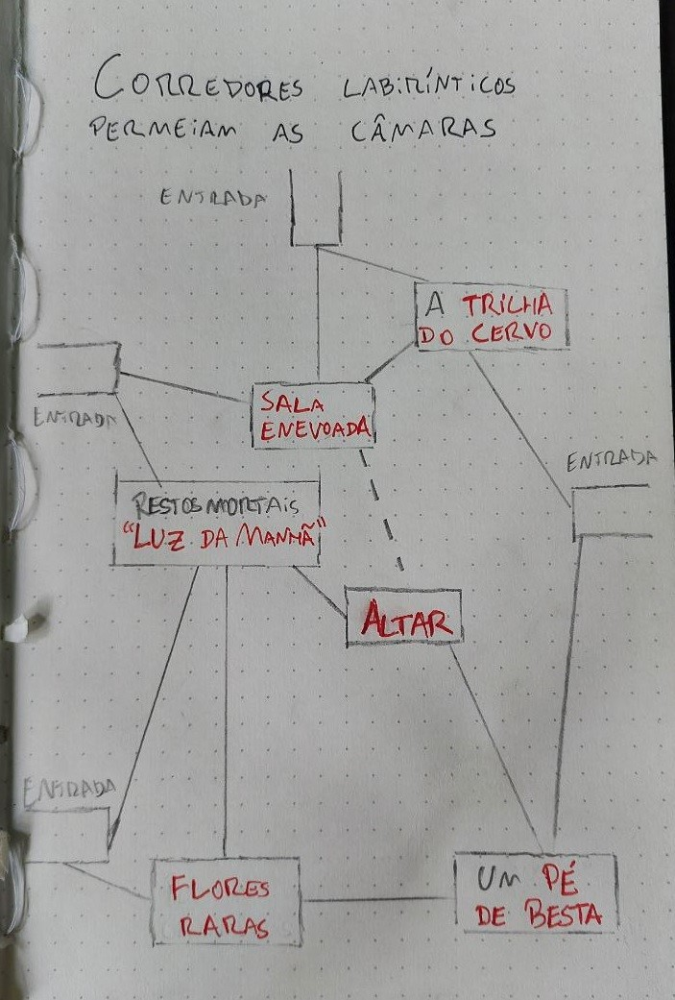

# HEX 0807 – O ALTAR DE CERNUDOS – Caio Palma

## Descrição Geral
A vegetação da Floresta dos Entes se adensa conforme a mata se aproxima da falésia da peninsula. Perto do mar o vento na floresta faz um assobio irregular, ali a vegetação parece formar corredores e câmaras.

## Tesouros e lares
- Numa das câmaras é possível colher flores utilizadas em receitas alquímicas;
- Um campeão do império caiu em luta contra a besta do labirinto há algumas décadas, sua maça estrela ilumina o canto de uma sala.;

## Labirinto de Cernudos
O labirinto que protege o Altar de Cernudos é repleto de névoa e corredores nada diretos. São quatro as “entradas” desse labirinto, apenas uma na direção do mar.
Entre as câmaras de entrada fica o altar. A besta que guarda o local espreita, tenta e engana os peregrinos que buscam o altar.

## A besta do labirinto
Esse cervídeo branco atroz (utilizar um Minotauro com feitiços de ilusão) possui olhos flamejantes e uma galhada enorme. Se morta, a besta renasce do fruto de uma árvore que cresce no labirinto em 8 (3d4) horas.

## SALAS DA DUNGEON

### Altar
O altar de Cernudos. Imaginei algo manchado de sangue e vísceras, mas não faço ideia se existe uma ideia visual pros altares já. Uma oferenda de sangue dá acesso às magias do altar.

### Luz da manhã
Num dos cantos da sala um esqueleto numa armadura toda perfurada está sendo absorvido pela vegetação do labirinto. No canto oposto algo brilha e a vegetação sinistra não cresce nessa fonte de luz (Estrela da manhã, maça estrela +1 que brilha como uma tocha).

### Trilha do cervo
O chão mostra uma trilha muito óbvia de um cervídeo atroz. As pegadas possuem quase dois palmos de largura e levam por um caminho nos corredores indo para uma sala enevoada. Essa trilha é ilusória.

### Flores raras
As paredes dessa sala possuem lindas flores roxo-escuras com detalhes azul-claro. O solo próximo a algumas delas possuem ossos de pequenas aves e roedores. 11 (3d6) flores podem ser colhidas, mas 4 (1d6) estão vivas e mordem (1d4 dano).

### Pé de besta
Uma grossa árvore de galhos retorcidos com 4 (2d4) frutas verde do tamanho de melões. Caso a besta morra, uma das frutas vai amadurecer em 8 (3d4) horas e dar à luz uma nova besta.

### Sala enevoada
A névoa toma por completo essa câmara e os corredores que levam a ela. Uma das paredes é falsa e leva para um corredor onde a névoa não entra. A névoa, a parede do corredor secreto e o chão no centro da câmara são ilusões. O centro cobre um buraco com estacas (1d8 de dano).
